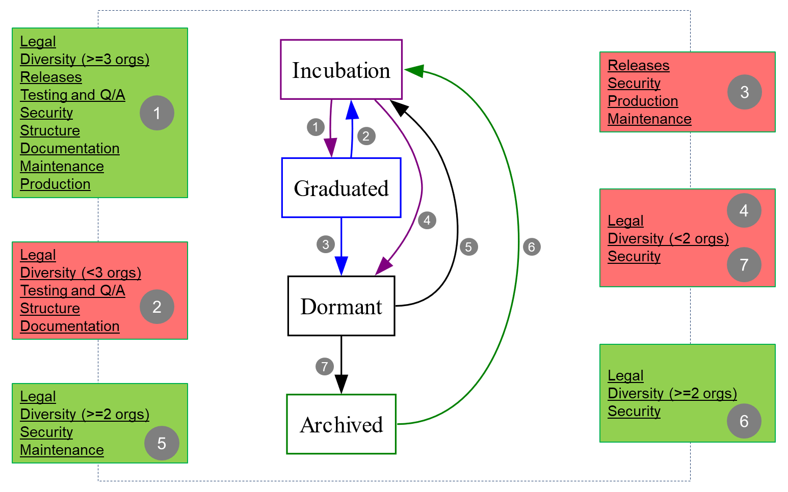

[//]: # 'SPDX-License-Identifier: CC-BY-4.0'

# Project Lifecycle

The term "project" within LF Decentralized Trust (LFDT) refers to a
collaborative endeavor to deliver a work item.
There may be some projects that are intended to produce a document, such
as a requirements or use cases document, a whitepaper, or analysis.
Other projects develop a new capability, refactor, or remove an
existing capability for the LFDT technology releases. Such
projects may take the form of a new component (e.g., a new repository) or
may propose additions, deletions, or changes to an existing
repository or repositories.

Many other open source initiatives leverage an incubation process for
new work items. Incubation seems to have the desired effect of encouraging
new ideas and tracks of work, while at the same time providing clear
guidance to the broader community as to what is real and supported,
versus what is still in the exploratory, experimental, or developmental
phases.

Therefore, LFDT has adopted a similar lifecycle process as
follows:

<!-- diagram source; if you need to update diagram, go to https://kroki.io/#try, choose graphviz, update the diagram, and copy the result of the GET command above.
  digraph lifecycle {
    node [shape=box]
    Incubation [color=purple];
    Incubation -> Graduated [color=purple, weight=1];
    Incubation -> Dormant [color=purple, weight=0];
    Graduated [color=blue];
    Graduated -> Incubation [color=blue, weight=0];
    Graduated -> Dormant [color=blue, weight=1];
    Dormant [color=black];
    Dormant:e -> Incubation [weight=0];
    Dormant -> Archived
    Archived [color=green]
    Archived:e -> Incubation:e [weight=0, color=green];
--> 

Projects are in one of four possible states:

- [_Incubation_](#incubation)
- [_Graduated_](#graduated)
- [_Dormant_](#dormant)
- [_Archived_](#archived)

Projects may not necessarily move through those states in a linear way
and may go through several iterations.

# Proposal

Project Proposals must be submitted to the [TAC] for review, using [Proposal Template].
Proposals that are approved enter into an _Incubation_ state, unless
they are of a refactoring nature, in which case the project is turned over
to the relevant project maintainers to handle as they deem fit.

A Proposal must:

- Have a clear description
- Have a well-defined scope
- Identify committed development resources
- Identify initial maintainers
- Be vendor neutral

# Incubation

Approved project proposals enter into _Incubation_. For new
components and modules, a repository is created under the
[LFDT Github Enterprise](https://github.com/enterprises/lf-decentralized-trust).
New features or capabilities must be handled through pull requests labeled
with tags that identify the project and tag it as
_incubator_. Pull requests ideally are capable of being enabled and disabled with feature-flags.

Projects in _Incubation_ can overlap with one another.
Entering _Incubation_ is meant to be fairly easy to allow for
community exploration of different ideas.

After a project qualifies to be declared _Graduated_, the
_project_ maintainers can then vote to request a graduation
review by the TAC.

Entering _Incubation_ does not guarantee that the project will
eventually get to the _Graduated_ state. Projects may never get
to the _Graduated_ state.

Projects seeking to graduate from _Incubation_ must meet
the criteria defined in the
[Incubation Exit Criteria](./project-incubation-exit.md) document.

# Graduated

(Formerly called 'Active') 

Projects that have successfully exited the _Incubation_ phase
are in the _Graduated_ phase.

The TAC may decide to move a _Graduated_ project that no longer meets
the [Incubation Exit Criteria](./project-incubation-exit.md) back to
the _Incubation_ state until it meets the criteria again.

# Dormant

(Covers the state formerly known as 'Deprecated') 

Projects enter the _Dormant_ state when the normal functions are
suspended, slowed down for a period of time, or the project is being
deprecated.

When possible, the maintainers of the project shall vote on such a change
of state and if it passes, make that recommendation to the TAC, but
anyone may propose that a project be moved to _Dormant_ state. Members
of the community who disagree with the request can make their case
before the TAC. The TAC will consider all points of view and render a
final decision.

If _Dormant_ projects are re-activated, they re-enter the _Incubation_
state even if they entered the _Dormant_ state from the _Graduated_ state.

# Archived

(Formerly called 'End of Life')

Projects that have been in the _Dormant_ state for a period of 6 months
will be automatically archived.

If anyone wants to resume work on an _Archived_ project they may
submit a proposal to the TAC for consideration.

If an _Archived_ project is re-activated, it re-enters the _Incubation_
state independent of its prior history.

[TAC]: https://www.lfdecentralizedtrust.org/staff?department=technical_oversight_committee
[Proposal Template]: https://lf-decentralized-trust.github.io/project-proposals

# Lifecycle Transition Guidelines and Recommendations

The TAC must evaluate a project's lifecycle state during its [annual review](./project-annual-review.md) and make one of the following decisions:
- Maintain its state
- Upgrade (e.g., *Incubation* to *Graduated*)
- Downgrade (e.g., *Graduated* to *Dormant*)

In addition, a project's lifecycle state should be evaluated during the quarterly updates if the TAC sees that a project is struggling to meet the requirements of its current state.

(*Note*: as a rough hierarchy, the *Graduated* state represents the highest maturity, followed by *Incubated*, followed by *Dormant*, followed by *Archived*.)

The following criteria MUST be considered for each project when making one of the aforementioned decisions:
- Legal
- Diversity
- Releases
- Testing and Q/A
- Security
- Structure
- Maintenance
- Production
- Documentation

## Description and Breakup of Criteria

Below is a guide for evaluating each of these criteria, with break-ups into sub-criteria that can be directly evaluated using one of three methods:
1. Checking their OpenSSF Scorecard scores
2. Checking their LFX Insights Best Practice Scores (produced by CLOMonitor) (Recommended, not required)
3. Manual inspection of code repositories

*Notes to keep in mind during evaluation*:
- The term "close to" below implies that a high (or highest) score is not mandatory but highly desired. If a project falls short on some such criteria but is otherwise mature and well-functioning, the TAC may ignore those criteria while encouraging the project's maintainers to strive for a higher score.
- Likewise, `SHOULD` and `SHOULD NOT` indicate that the stated criteria is subjective and not mandatory; if a project does not meet the given criteria, its status should be highlighted and debated during the [annual review](./project-annual-review.md) process.
- A project may consist of multiple GitHub repositories. Several criteria below mention whether they must apply to at least one repository or to all repositories. Wherever this is not mentioned, the assumption should be that at least one repository must meet the given criterion. The project's maintainers shall have the right to designate one or more repositories for evaluation by the TAC whenever required, and these repositories may change from one cycle to the next.

### Legal Criteria

- (OpenSSF Score): *License*: MUST be 10

### Diversity Criteria

- (OpenSSF Score): *Contributors*: SHOULD be close to 10
- (Manual): the `MAINTAINERS.md` files in the project's repositories MUST collectively indicate the involvement of more than one organization

- Evaluation:
  * To be a *Graduated* project, the number of organizations from which maintainers are drawn must be at least 3, and the OpenSSF Score SHOULD be 10.
  * To be an *Incubated* project, the number of organizations from which maintainers are drawn must be at least 2.

### Releases

- (OpenSSF Score): *Packaging*: SHOULD be 10
- (Manual): determined by inspecting the project's repositories, at least one of the repositories MUST have 2 or more releases in the past year

### Testing and Q/A

- (OpenSSF Score): *CI Tests*: SHOULD be 10

### Security

- (OpenSSF Score): *Dangerous Workflow*: MUST be 10
- (OpenSSF Score): *Token Permissions*: MUST be 10
- (OpenSSF Score): *Branch-Protection*: MUST be 9 (Tier 4)
- (OpenSSF Score): *Dependency-Update-Tools*: MUST be 10
- (OpenSSF Score): *Fuzzing*: SHOULD be close to 10
- (OpenSSF Score): *Pinned-Dependencies*: SHOULD NOT be 0
- (OpenSSF Score): *SAST*: SHOULD be close to 10
- (OpenSSF Score): *Security-Policy*: SHOULD be at least 9
- (OpenSSF Score): *Signed-Releases*: (based on the Security Artifacts Task Force's conclusions)
  * To be a *Graduated* project, MUST be 10.
  * To be an *Incubated* project, MUST be 8.
- (OpenSSF Score): *Token-Permissions*: MUST be 10
- (OpenSSF Score): *Vulnerabilities*: SHOULD be 10
- (Manual): the contents of the `SECURITY.md` files in the project's repositories must comply with [LFDT requirements](./security.md)

### Structure

- (LFX Insights Best Practice Score): SHOULD be 50% or higher (averaged over all repositories)
- (Manual): check if the repositories follow the [repository structure guidelines](./repository-structure.md)

### Maintenance

- (OpenSSF Scorecard): *Code Review*: MUST be 10
- (Manual): frequency of pull requests, Discord activity, and mailing list activity, must be reasonably high

### Production

- (Manual): an `ADOPTERS.md` file SHOULD be present in at least one of the project's repositories, and contain at least one reference to the project's real-world usage. (Absence of this should prompt questions by the TAC during a review, and if all the other evaluation criteria are favorable, this requirement MAY be disregarded in favor of a simple inspection of the repositories for production-readiness.)

### Documentation

- (LFX Insights Best Practice Score): MUST be 50% or higher (averaged over all repositories)
- (Manual): The project must have at least one documentation website (it may have more if it is releasing multiple separate tools) that is not a skeleton (i.e., only titles and links, with no content)

## Evaluation of Criteria for State Transition Decisions

The below figure illustrates the criteria that MUST be evaluated and considered for the respective lifecycle transitions (denoted by arrows between stages).
- The groups of criteria marked in green indicate that a project is ready to make an upgrade transition, or is at least qualified to remain in its present state. The decision is at the discretion of the TAC.
- The groups of criteria marked in red indicate that a project is a candidate for a downgrade, at the discretion of the TAC.
- In either case, the subjective metrics (those marked with *SHOULD* or *close to* in the list further above) can be treated as optional when it comes to making a decision about a state transition, but the other metrics (marked with *MUST*) are mandatory for a project to preserve it's state or to qualify for an upgrade.

### Projects Outside the Lifecycle

A project accepted by the LFDT can enter the lifecycle only through the *Incubation* state. This applies to:
- New projects presented to the TAC
- Projects that were formerly *Archived* and wish to resume development activity
- LFDT Labs projects

Therefore, the qualification for a project to be accepted by the LFDT TAC and to begin its official lifecycle is the set of criteria marked (6) in the above diagram, namely:
1. Legal
2. Diversity (>=2 maintaining organizations)
3. Security

## Reference

### History

A [Badging and Lifecycle Task Force](https://github.com/hyperledger/toc/issues/50) was launched in early 2023 to identify badging criteria for LFDT projects and to use those badges as project health indicators. This was intended to help the TAC determine whether a project ought to be moved to a different lifecycle stage. It was also intended to help users and contributors to make an assessment about the project's maturity.

But, based on on the assessment of the [OpenSSF Scorecard Task Force](https://docs.google.com/presentation/d/18zO30diSW1jUfQwoglWza0Lx2_Q8vwuE__q-JdoC3ho/edit#slide=id.g2dd524f49cb_0_28) and experience with the CLOMonitor tool in LFX Insights, the need for extra badges was deemed unnecessary. This is because the broad criteria and associated scores produced on an ongoing basis by the monitoring tools (OpenSSF Scorecard and CLOMonitor) are almost sufficient to cover the original badging criteria debated by the TAC.

Still, the TAC needs guidelines to determine how to evaluate the criteria and scores produced by the given monitoring tools. Therefore, in this section, we have made recommendations for such evaluations, with the caveat that any decision made about a project's place in the lifecycle diagram will be at the subjective discretion of the TAC.

### Links

- Description of OpenSSF Scorecard criteria referenced in this document: https://github.com/ossf/scorecard/blob/main/docs/checks.md
- Example OpenSSF scorecard (for Hyperledger Cacti): https://scorecard.dev/viewer/?uri=github.com%2Fhyperledger%2Fcacti
- Example LFX Insights Page with CLOMonitor-derived info (for Hyperledger Fabric): https://insights.lfx.linuxfoundation.org/foundation/lf-decentralized-trust/overview/best-practice-score?project=fabric
