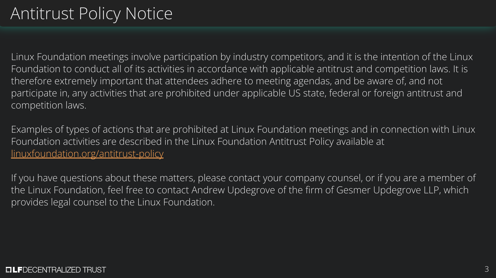
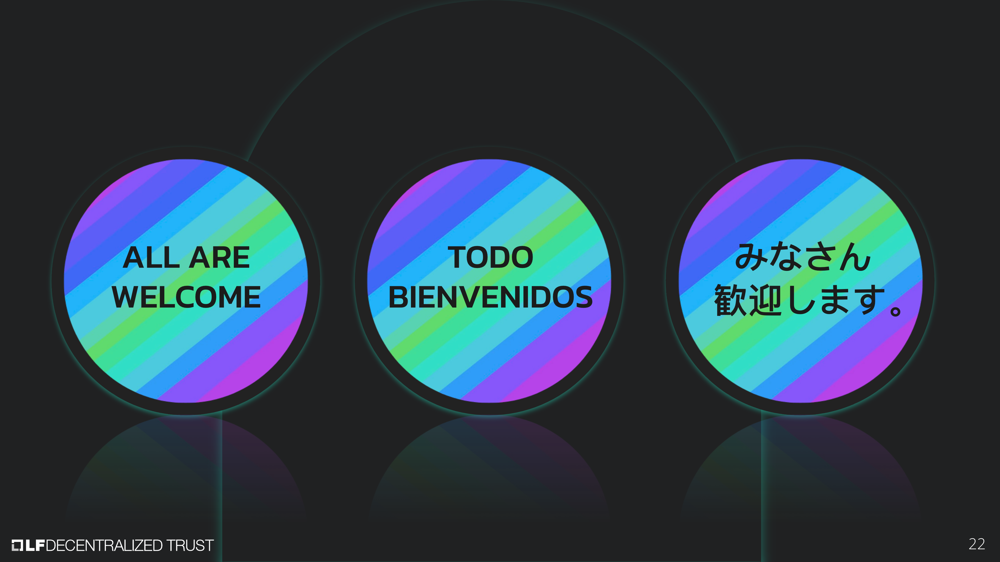

[//]: # (SPDX-License-Identifier: CC-BY-4.0)

Linux Foundation Decentralized Trust is committed to creating a safe and welcoming community for all. For more information please visit our Code of Conduct: [LF Decentralized Trust Code of Conduct](../../governing-documents/code-of-conduct.md).

# Announcements
- The [LF Decentralized Trust /dev/weekly developer newsletter](https://lf-hyperledger.atlassian.net/wiki/spaces/DR/pages/17170445/dev+weekly+Newsletter) goes out each Friday to hundreds of LF Decentralized Trust developers. It is a collaborative effort. If you have a project release, pull request, community event, and/or relevant article you would like highlighted next week, please [leave a comment for consideration on the upcoming newsletter wiki page](https://lf-hyperledger.atlassian.net/wiki/spaces/DR/pages/75268141/2025).
- Weds March 26th @ 8amPT, join the Besu community for the LF Decentralized Trust workshop, “Configure, Deploy, and Manage a Besu Private Network.” This free workshop + 30%-off coupon code BCPW325 (expires 4/30) gets you ready for the Besu Certified Professional Certification @ LF Training.
  [Register here](https://zoom.us/webinar/register/8117379999563/WN_NZ8FgWbdThiDp_8TCByjkQ). [Find out more on the wiki](https://lf-hyperledger.atlassian.net/wiki/spaces/events/pages/92372993/Configure+Deploy+and+Manage+a+Besu+Private+Network).

# Quarterly reports
- [2024 Q4 Besu](https://github.com/LF-Decentralized-Trust/governance/pull/92)
- [2024 Q4 Hyperledger Solang (due November 21, 2024)](https://github.com/LF-Decentralized-Trust/governance/pull/96)

# Annual reports
- [Hyperledger Bevel Annual Report](https://github.com/LF-Decentralized-Trust/governance/pull/113) (Marcus and Wenjing to review at the March 27th meeting)
- [Hyperledger Caliper Annual Report](https://github.com/LF-Decentralized-Trust/governance/pull/115) (Peter and Enrique to review at the March 27th meeting)
- [Hyperledger FireFly Annual Report](https://github.com/LF-Decentralized-Trust/governance/pull/117) (Wenjing and Hendrik to review at the April 3rd meeting)
- [Hypelerdger Cello Annual Report](https://github.com/LF-Decentralized-Trust/governance/pull/118) - needs to be updated due to wrong format (Hendrik and Arun)
- [Hiero Annual Report](https://github.com/LF-Decentralized-Trust/governance/pull/122) (Tracy and Matthew to review at the April 10th meeting)

# Overdue reports
- Hyperledger Solang Annual Report(due February 13, 2025) (Char and Tracy)
- Besu Annual Report (due February 27, 2025) (Arun and Wenjing)
- Lockness Annual Report (due March 6, 2025) (Rama and Char)

# Upcoming reports
- Credebl Annual Report (due March 20, 2025) (Enrique and Peter)
- ToIP (due March 27, 2025) (Diane and Rama)
- [2025 TAC Project Update Calendar](../../project-updates/2025/2025-schedule.md)

# Discussion
- Reports needing approval
    - [Hyperledger Cacti Annual Report](https://github.com/LF-Decentralized-Trust/governance/pull/108) (Arun and Enrique) - waiting on confirmation of changes requested
        - Approved by roll call vote, 11 aye
    - [Hyperledger Iroha](https://github.com/LF-Decentralized-Trust/governance/pull/109) (Matthew and Marcus)
    - [Hyperledger AnonCreds Annual Report](https://github.com/LF-Decentralized-Trust/governance/pull/98) (Diane and Rama)
        - Approved by roll call vote, 11 aye
- [Web3j Annual Report](https://github.com/LF-Decentralized-Trust/governance/pull/112) (Marcus and Char)

# Recordings
- [Recordings are available on the LF Decentralized Trust calendar](https://zoom-lfx.platform.linuxfoundation.org/meetings/lf-decentralized-trust)

# Upcoming meetings
- [Please check the calendar](https://zoom-lfx.platform.linuxfoundation.org/meetings/lf-decentralized-trust)

# Attended by

- [x] Marcus Brandenburger
- [x] Wenjing Chu
- [x] Hendrik Ebbers
- [x] Char Howland
- [x] Tracy Kuhrt
- [x] Enrique Lacal
- [x] Diane Mueller
- [x] Venkatraman Ramakrishna
- [x] Arun S M
- [x] Peter Somogyvari
- [x] Matthew Whitehead
