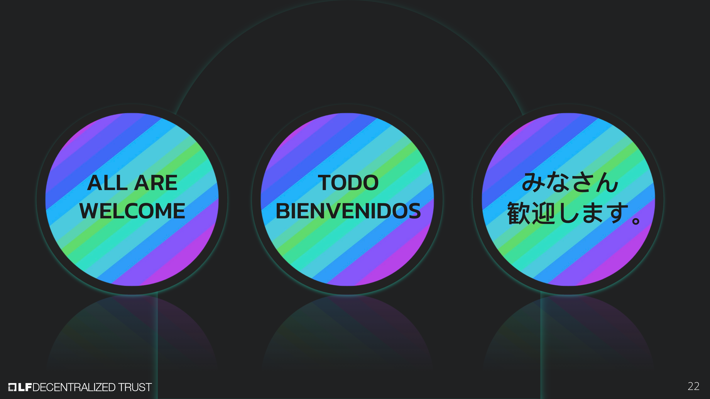

[//]: # (SPDX-License-Identifier: CC-BY-4.0)

Linux Foundation Decentralized Trust is committed to creating a safe and welcoming community for all. For more information please visit our Code of Conduct: [LF Decentralized Trust Code of Conduct](../../governing-documents/code-of-conduct.md).

# Meeting Link
- [Join us on Zoom](https://zoom-lfx.platform.linuxfoundation.org/meeting/95530440160?password=6e6b9a15-a635-497e-a6ce-078e6b1d2b49)

# Announcements
- The [LF Decentralized Trust /dev/weekly developer newsletter](https://lf-hyperledger.atlassian.net/wiki/spaces/DR/pages/17170445/dev+weekly+Newsletter) goes out each Friday to hundreds of LF Decentralized Trust developers. It is a collaborative effort. If you have a project release, pull request, community event, and/or relevant article you would like highlighted next week, please [leave a comment for consideration on the upcoming newsletter wiki page](https://lf-hyperledger.atlassian.net/wiki/spaces/DR/pages/75268141/2025).

# Annual reports
- [Lockness Annual Report](https://github.com/LF-Decentralized-Trust/governance/pull/149) (due March 6, 2025) (Rama and Char)

# Quarterly reports
- [Hyperledger Cacti Q2 Report](https://github.com/LF-Decentralized-Trust/governance/pull/132)
- [Hyperledger Identus Q2 Report](https://github.com/LF-Decentralized-Trust/governance/pull/137)
- [Hyperledger Fabric Q2 Report](https://github.com/LF-Decentralized-Trust/governance/pull/139)
- [Hyperledger AnonCreds Q2 Report](https://github.com/LF-Decentralized-Trust/governance/pull/140)
- [Hyperledger Aries Q2 Report](https://github.com/LF-Decentralized-Trust/governance/pull/142)
- [Hyperledger Iroha Q2 Report](https://github.com/LF-Decentralized-Trust/governance/pull/143)
- [Hyperledger Bevel Q2 Report](https://github.com/LF-Decentralized-Trust/governance/pull/146)

# Overdue reports
- ToIP Annual Report (due March 27, 2025) (Diane and Rama)
- Hyperledger Web3j Q2 Report (due April 10, 2025)
- Hyperledger Cello Q2 Report (due May 8, 2025)
- Hyperledger Solang Q2 Report (due May 8, 2025)

# Upcoming reports
- Hyperledger FireFly Q2 Report (due May 15, 2025)
- Besu Q2 Report (due May 22, 2025)
- Hyperledger Caliper Q2 Report (May 22, 2025)
- [2025 TAC Project Update Calendar](../../project-updates/2025/2025-schedule.md)

# Discussion
- [VelocityCore Project Proposal](https://github.com/LF-Decentralized-Trust/project-proposals/pull/26)
    - Will come in as a lab
- [Hypelerdger Cello Annual Report](https://github.com/LF-Decentralized-Trust/governance/pull/118) (Hendrik and Arun to update time permitting)
- [Hiero Annual Report](https://github.com/LF-Decentralized-Trust/governance/pull/128) (Tracy and Matthew to update time permitting)
    - Motion to keep Hiero in incubation status passes by unanimous voice vote
- [Hyperledger Solang Annual Report](https://github.com/LF-Decentralized-Trust/governance/pull/135) (Char and Tracy to update time permitting)
    - Motion to keep Hyperledger Solang in incubation status passes by unanimous voice vote
- [Besu Annual Report](https://github.com/LF-Decentralized-Trust/governance/pull/129) (Arun and Wenjing to review time permitting)
- [Credebl Annual Report](https://github.com/LF-Decentralized-Trust/governance/pull/138) (Enrique and Peter to review at May 15 meeting)

# Recordings
- [Recordings are available on the LF Decentralized Trust calendar](https://zoom-lfx.platform.linuxfoundation.org/meetings/lf-decentralized-trust)

# Upcoming meetings
- [Please check the calendar](https://zoom-lfx.platform.linuxfoundation.org/meetings/lf-decentralized-trust)

# Attended by

- [x] Marcus Brandenburger
- [ ] ~~Wenjing Chu~~
- [x] Hendrik Ebbers
- [x] Char Howland
- [x] Tracy Kuhrt
- [x] Enrique Lacal
- [x] Diane Mueller
- [x] Venkatraman Ramakrishna
- [x] Arun S M
- [x] Peter Somogyvari
- [x] Matthew Whitehead
