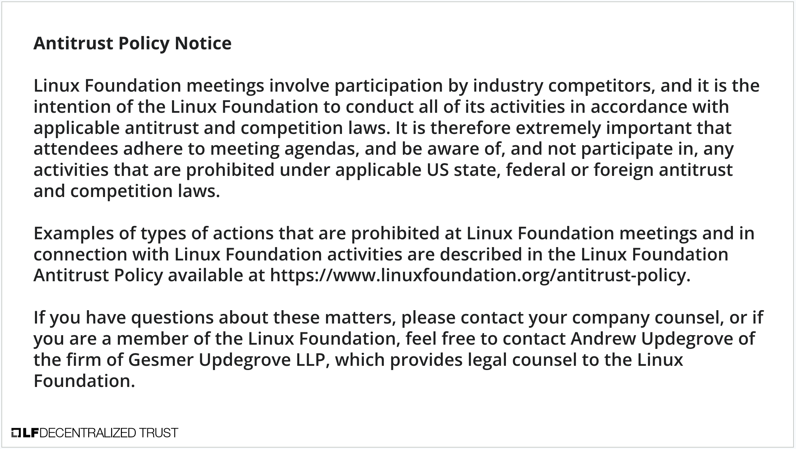

[//]: # (SPDX-License-Identifier: CC-BY-4.0)

Linux Foundation Decentralized Trust is committed to creating a safe and welcoming community for all. For more information please visit our Code of Conduct: [LF Decentralized Trust Code of Conduct](../../governing-documents/code-of-conduct.md).

# Meeting Link
- [Join us on Zoom](https://zoom-lfx.platform.linuxfoundation.org/meeting/95530440160?password=6e6b9a15-a635-497e-a6ce-078e6b1d2b49)

# Announcements
- The [LF Decentralized Trust /dev/weekly developer newsletter](https://lf-hyperledger.atlassian.net/wiki/spaces/DR/pages/17170445/dev+weekly+Newsletter) goes out each Friday to hundreds of LF Decentralized Trust developers. It is a collaborative effort. If you have a project release, pull request, community event, and/or relevant article you would like highlighted next week, please [leave a comment for consideration on the upcoming newsletter wiki page](https://lf-hyperledger.atlassian.net/wiki/spaces/DR/pages/75268141/2025).

# Quarterly reports
- [Hyperledger Solang Q2 Report](https://github.com/LF-Decentralized-Trust/governance/pull/160)
- [Hiero Q2 Report](https://github.com/LF-Decentralized-Trust/governance/pull/162)
- [Besu Q2 Report](https://github.com/LF-Decentralized-Trust/governance/pull/169)
- [AnonCreds Q3 Report](https://github.com/LF-Decentralized-Trust/governance/pull/171)
- [Hyperledger Cacti Q3 Report](https://github.com/LF-Decentralized-Trust/governance/pull/173)
- [Hyperledger Indy Q3 Report](https://github.com/LF-Decentralized-Trust/governance/pull/176)

# Overdue reports
- ToIP Annual Report (due March 27, 2025) (Diane and Rama)
- Lockness Q2 Report (due June 05, 2025)
- Credebl Q2 Report (due June 19, 2025)
- ToIP Q2 Report (due June 26, 2025)
- Hyperledger Fabric Q3 Report (due July 10, 2025)
- Hyperledger Identus Q3 Report (due July 17, 2025)
- Web3j Q3 Report (due July 17, 2025)
- Hyperledger Iroha Q3 Report (due August 07, 2025)
- Hyperledger Bevel Q3 Report (due August 07, 2025)

# Upcoming reports
- Hyperledger Solang Q3 Report (due August 14, 2025)
- Hyperledger FireFly Q3 Report (due August 21, 2025)
- [2025 TAC Project Update Calendar](../../project-updates/2025/2025-schedule.md)

# Discussion
- Hard discussion about quarterly reports
- [Lockness Annual Report](https://github.com/LF-Decentralized-Trust/governance/pull/149) (Rama and Char to provide update)
    - Approved for merge by unanimous voice vote.
- [Hiero graduation request](https://github.com/LF-Decentralized-Trust/project-proposals/pull/30)
- [Defining Adopters](https://github.com/LF-Decentralized-Trust/governance/pull/164)
- Lab Stewards discussion (time permitting)

# Recordings
- [Recordings are available on the LF Decentralized Trust calendar](https://zoom-lfx.platform.linuxfoundation.org/meetings/lf-decentralized-trust)

# Upcoming meetings
- [Please check the calendar](https://zoom-lfx.platform.linuxfoundation.org/meetings/lf-decentralized-trust)

# Attended by

- [x] Marcus Brandenburger
- [x] Wenjing Chu
- [x] Hendrik Ebbers
- [x] Char Howland
- [x] Tracy Kuhrt
- [ ] ~~Enrique Lacal~~
- [x] Diane Mueller
- [x] Venkatraman Ramakrishna
- [x] Arun S M
- [ ] ~~Peter Somogyvari~~
- [ ] ~~Matthew Whitehead~~
