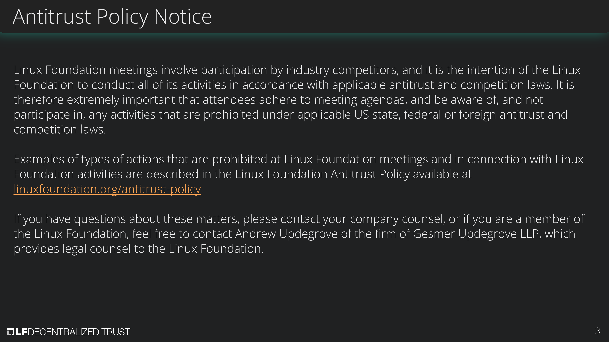

[//]: # (SPDX-License-Identifier: CC-BY-4.0)

Linux Foundation Decentralized Trust is committed to creating a safe and welcoming community for all. For more information please visit our Code of Conduct: [LF Decentralized Trust Code of Conduct](../../governing-documents/code-of-conduct.md).

# Meeting Link
- [Join us on Zoom](https://zoom-lfx.platform.linuxfoundation.org/meeting/92525158319?password=28229c13-3104-43dc-a882-0891187679cf)

# Announcements
- The [LF Decentralized Trust /dev/weekly developer newsletter](https://lf-hyperledger.atlassian.net/wiki/spaces/DR/pages/17170445/dev+weekly+Newsletter) goes out each Friday to hundreds of LF Decentralized Trust developers. It is a collaborative effort. If you have a project release, pull request, community event, and/or relevant article you would like highlighted next week, please [leave a comment for consideration on the upcoming newsletter wiki page](https://lf-hyperledger.atlassian.net/wiki/spaces/DR/pages/697270275/2026).
- TAC to review the [Linux Foundation Decentralized Trust Mentorship Proposals](https://github.com/LF-Decentralized-Trust-Mentorships/mentorship-program/issues).
- On April 1st at NoonET, teams from CPqD and DSR will join the LFDT Meetup community to share their work implementing Indy on Besu. Join us: [https://www.meetup.com/lfdt-nyc/events/313733107/](https://www.meetup.com/lfdt-nyc/events/313733107/)

# Annual reports
- [Hyperledger Cacti Annual Report](https://github.com/LF-Decentralized-Trust/governance/pull/285) - Hendrik, Matthew 
- [Hyperledger Identus Annual Report](https://github.com/LF-Decentralized-Trust/governance/pull/288) - Enrique, Rama
- [Hyperledger AnonCreds Annual Report](https://github.com/LF-Decentralized-Trust/governance/pull/286) - Diane, Yoav
- [Web3J Annual Report](https://github.com/LF-Decentralized-Trust/governance/pull/294) - Marcus, Kanchan
- [Lockness Annual Report](https://github.com/LF-Decentralized-Trust/governance/pull/298) - Matthew, Hendrik
- [Hiero Annual Report](https://github.com/LF-Decentralized-Trust/governance/pull/299) - Enrique, Kanchan

# Overdue reports
- Hyperledger Iroha Annual Report (due February 12, 2026)
- Hyperledger Solang Annual Report (due February 12, 2026)
- Firefly Annual Report (due February 26, 2026)
- Besu Annual Report (due February 26, 2026)
- Credebl Annual Report (due March 12, 2026)
- ToIP Annual Report (due March 12, 2026)

# Upcoming reports
- Paladin Annual Report (due March 19, 2026)
- Smoot Annual Report (due March 19, 2026)
- Minokowa Annual Report (due March 19, 2026)
- [2026 TAC Project Update Calendar](../../project-updates/2026/2026-schedule.md)

# Labs summary
- None

# Discussion
- Project report reviews, find the [TAC member assignment worksheet](https://docs.google.com/spreadsheets/d/1u1yKuu8dl00ie-Nsm1sFJcIF82njYJw0swfEidx5Foo/edit?gid=1376954816#gid=1376954816) for reviews.
- New [sub-project naming policy guideline document](https://github.com/LF-Decentralized-Trust/wiki/wiki/Naming-Guidelines#sub-project-naming-guidelines).
- How TAC can actively promote and guide project teams toward SLSA-aligned best practices?
- Framework for assigning phases/maturity levels to sub‑projects independently (e.g., Fabric vs. Fabric‑X).
- Project report cadence and alternate strategies.

# Recordings
- [Recordings are available on the LF Decentralized Trust calendar](https://zoom-lfx.platform.linuxfoundation.org/meetings/lf-decentralized-trust)

# Upcoming meetings
- [Please check the calendar](https://zoom-lfx.platform.linuxfoundation.org/meetings/lf-decentralized-trust)

# Attended by

- [ ] Marcus Brandenburger
- [ ] Hendrik Ebbers
- [ ] Kanchan Kaur
- [ ] Kevin Millikin
- [ ] Enrique Lacal
- [ ] Diane Mueller
- [ ] Venkatraman Ramakrishna
- [ ] Osama Rabea
- [ ] Yoav Tock
- [ ] Matthew Whitehead
- [ ] Arun S M
