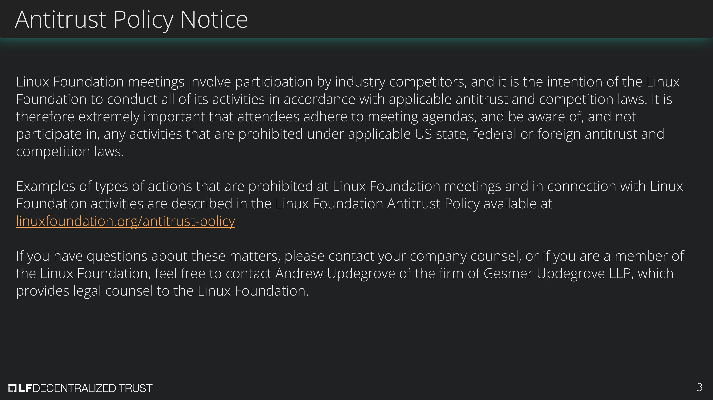
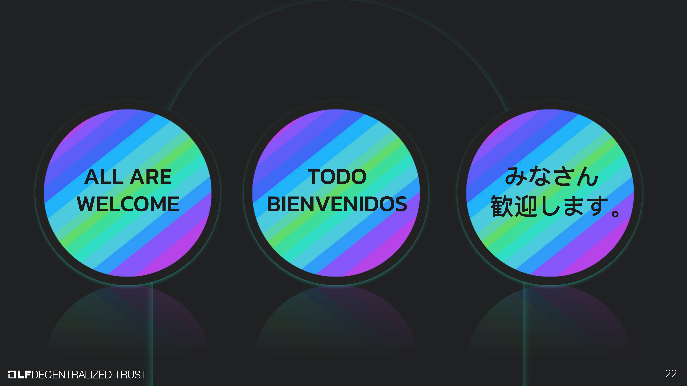

[//]: # (SPDX-License-Identifier: CC-BY-4.0)

Linux Foundation Decentralized Trust is committed to creating a safe and welcoming community for all. For more information please visit our Code of Conduct: [LF Decentralized Trust Code of Conduct](../../governing-documents/code-of-conduct.md).

# Meeting Link
- [Join us on Zoom](https://zoom-lfx.platform.linuxfoundation.org/meeting/96405933609?password=dc76428e-6a2d-435f-a020-a590bc4b94a4)

# Announcements
- The [LF Decentralized Trust /dev/weekly developer newsletter](https://lf-hyperledger.atlassian.net/wiki/spaces/DR/pages/17170445/dev+weekly+Newsletter) goes out each Friday to hundreds of LF Decentralized Trust developers. It is a collaborative effort. If you have a project release, pull request, community event, and/or relevant article you would like highlighted next week, please [leave a comment for consideration on the upcoming newsletter wiki page](https://lf-hyperledger.atlassian.net/wiki/spaces/DR/pages/697270275/2026).
- Hiero Community Day on July 7, 2026 in Bergen, Norway — the day before the WeAreDevelopers conference; open to the broader LF Decentralized Trust community.
- TAC mid-year retrospection is open for anonymous feedback. TAC members are requested to share what is working well and what can be improved for the rest of 2026: https://retrotool.io/BYYlkqSEySlENjM6c2pXd

# Annual reports
- [Smoot Annual Report](https://github.com/LF-Decentralized-Trust/governance/pull/326) - Hendrik, Marcus
- [ToIP Annual Report](https://github.com/LF-Decentralized-Trust/governance/pull/332) - Diane, Yoav

# Overdue reports
- Hyperledger Solang Annual Report (due February 12, 2026) - Stellar Foundation grant accepted; annual report still pending
  - Motion to move Solang to a lab passes on voice vote, seven aye, four absent
- Minokawa Annual Report (due March 19, 2026) - project team working on it

# Upcoming reports
- [2026 TAC Project Update Calendar](../../project-updates/2026/2026-schedule.md)

# Labs summary
- [Veltora Core](https://github.com/LF-Decentralized-Trust-labs/LF-Decentralized-Trust-labs.github.io/pull/389) - system-agnostic, multi-pair optimization architecture that jointly optimizes execution and liquidity participation within a unified feasibility framework
- [OSRDA (Open Standards for Regulated Digital Assets)](https://github.com/LF-Decentralized-Trust-labs/LF-Decentralized-Trust-labs.github.io/pull/404) - open implementation patterns for the interoperation of tokenised real-world regulated financial assets and the markets they participate in

# Discussion
- [Discussion on project charters for LFDT Labs](https://docs.google.com/document/d/1uremzk7OkM4fRZXlVnE11wI3UeGrBv7iw4ijuB16Xqw/edit?tab=t.0).
- AI contribution guidelines — Rafael's [governance PR #321](https://github.com/LF-Decentralized-Trust/governance/pull/321); Hendrik and Diane to share feedback collected from the Hiero TSC community.
- ADOPTERS.md going forward — cross-referencing project ADOPTERS.md files with the use case tracker (350 entries today); follow-up on progress and read-only access for maintainers.
- Mid-year report template and expectations under the new twice-yearly cadence (governance PR #319 merged on May 8, 2026).
- DCO mechanical friction — document common sign-off issues (browser/IDE mismatches) and resolutions alongside the [LF legal team's guidance page](https://lfprojects.org/policies/dco/).
- Documenting labs policy (approval-by-absence-of-objection, historical rejection rationale) for new TAC members.
- How TAC can actively promote and guide project teams toward SLSA-aligned best practices?
- Framework for assigning phases/maturity levels to sub‑projects independently (e.g., Fabric vs. Fabric‑X).
- Proposal for an AI working group within LF Decentralized Trust, with alignment to the LF Agentic AI sub-foundation (Hendrik).

# Recordings
- [Recordings are available on the LF Decentralized Trust calendar](https://zoom-lfx.platform.linuxfoundation.org/meetings/lf-decentralized-trust)

# Upcoming meetings
- [Please check the calendar](https://zoom-lfx.platform.linuxfoundation.org/meetings/lf-decentralized-trust)

# Attended by

- [x] Marcus Brandenburger
- [ ] ~~Hendrik Ebbers~~
- [ ] ~~Kanchan Kaur~~
- [ ] ~~Kevin Millikin~~
- [x] Enrique Lacal
- [x] Diane Mueller
- [x] Venkatraman Ramakrishna
- [ ] ~~Osama Rabea~~
- [x] Arun S M
- [x] Yoav Tock
- [x] Matthew Whitehead
