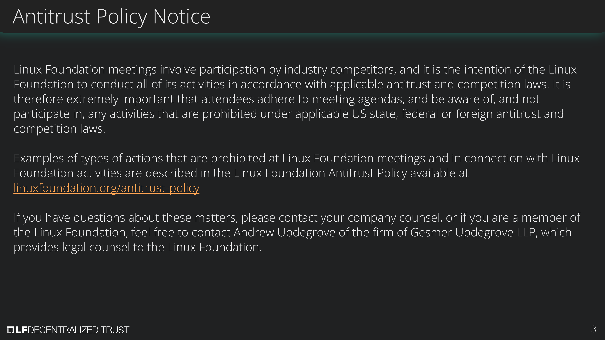
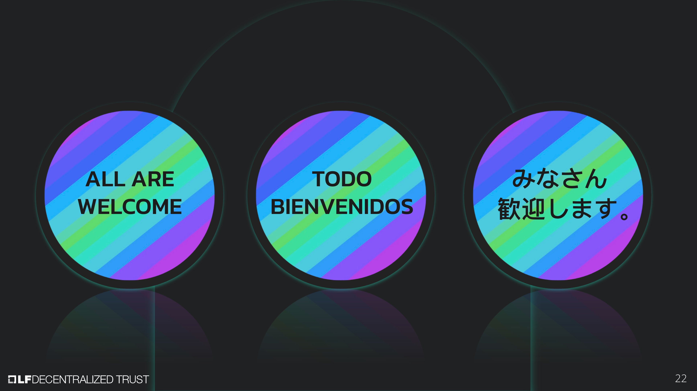

[//]: # (SPDX-License-Identifier: CC-BY-4.0)

Linux Foundation Decentralized Trust is committed to creating a safe and welcoming community for all. For more information please visit our Code of Conduct: [LF Decentralized Trust Code of Conduct](../../governing-documents/code-of-conduct.md).

# Meeting Link
- [Join us on Zoom](https://zoom-lfx.platform.linuxfoundation.org/meeting/96405933609?password=dc76428e-6a2d-435f-a020-a590bc4b94a4)

# Announcements
- The [LF Decentralized Trust /dev/weekly developer newsletter](https://lf-hyperledger.atlassian.net/wiki/spaces/DR/pages/17170445/dev+weekly+Newsletter) goes out each Friday to hundreds of LF Decentralized Trust developers. It is a collaborative effort. If you have a project release, pull request, community event, and/or relevant article you would like highlighted next week, please [file an issue here](https://github.com/LF-Decentralized-Trust/contribute/issues).
- Nominations for the 2027 TAC open on October 13, 2026 and close on October 30, 2026. See the [election timeline](https://lf-decentralized-trust.github.io/governance/member-info/election-timeline/) for more details. TAC members are encouraged to engage with the community, identify strong candidates, and encourage them to consider standing for election.
- The [LFDT AI Working Group kickoff](https://www.meetup.com/lfdt-sf/events/316485550/), "AI × Decentralized Trust", is on October 6, 2026 at 9:00 AM Pacific. The session will set the group's initial scope, meeting cadence, and first work streams. Open to everyone.

# Annual reports
- [Minokawa Annual Report](https://github.com/LF-Decentralized-Trust/governance/pull/378) - Osama, Marcus

# Mid-year reports
- [Cacti Mid-Year Report](https://github.com/LF-Decentralized-Trust/governance/pull/353)
- [Hiero Mid-Year Review](https://github.com/LF-Decentralized-Trust/governance/pull/354)
- [Iroha Mid-Year Review](https://github.com/LF-Decentralized-Trust/governance/pull/356)
- [Web3j Mid-Year Review](https://github.com/LF-Decentralized-Trust/governance/pull/360)
- [Besu Mid-Year Review](https://github.com/LF-Decentralized-Trust/governance/pull/368)
- [Fabric Mid-Year Review](https://github.com/LF-Decentralized-Trust/governance/pull/370)
- [FireFly Mid-Year Report](https://github.com/LF-Decentralized-Trust/governance/pull/377)
- [Identus Mid-Year Report](https://github.com/LF-Decentralized-Trust/governance/pull/383)
- [Paladin Mid-Year Report](https://github.com/LF-Decentralized-Trust/governance/pull/386)

# Overdue reports
- Indy Mid-Year Report (due August 13, 2026)
- Lockness Mid-Year Report (due September 3, 2026) - extension granted to the first week of October
- Credebl Mid-Year Report (due September 10, 2026)

# Upcoming reports
- [2026 TAC Project Update Calendar](../../project-updates/2026/2026-schedule.md)

# Labs summary
- [Fabric-X-Migrate](https://github.com/LF-Decentralized-Trust/lab-proposals/pull/22) - a CLI tool to migrate application state from Hyperledger Fabric peer snapshots into Fabric-X
- [Open Privacy Suite](https://github.com/LF-Decentralized-Trust/lab-proposals/pull/16) - a privacy and access-control gateway for EVM permissioned networks that enforces per-organization transaction privacy, role-based method access, and auditable selective disclosure

# Discussion
- Review and close open project reports.
	- Minokawa approved by voice vote
- Open Wallet Foundation (OWF) project migration - review and vote. The [eudiplo](https://github.com/LF-Decentralized-Trust/project-proposals/pull/59) maintainers will join the call.
	- Approved by roll call vote, 7 aye
- Lab proposals are now raised as pull requests on the [lab-proposals](https://github.com/LF-Decentralized-Trust/lab-proposals) repository.
- Clarification on the wording for a project, making space for experimentation within each top level project.
- EU Cyber Resilience Act - gaps in our governance documents.
- Guidelines on the use of AI - [PR #321](https://github.com/LF-Decentralized-Trust/governance/pull/321).

# Recordings
- [Recordings are available on the LF Decentralized Trust calendar](https://zoom-lfx.platform.linuxfoundation.org/meetings/lf-decentralized-trust)

# Upcoming meetings
- [Please check the calendar](https://zoom-lfx.platform.linuxfoundation.org/meetings/lf-decentralized-trust)

# Attended by

- [x] Marcus Brandenburger
- [x] Hendrik Ebbers
- [ ] ~~Kanchan Kaur~~
- [x] Kevin Millikin
- [x] Enrique Lacal
- [x] Diane Mueller
- [ ] ~~Venkatraman Ramakrishna~~
- [ ] ~~Osama Rabea~~
- [x] Arun S M
- [ ] ~~Yoav Tock~~
- [x] Matthew Whitehead
