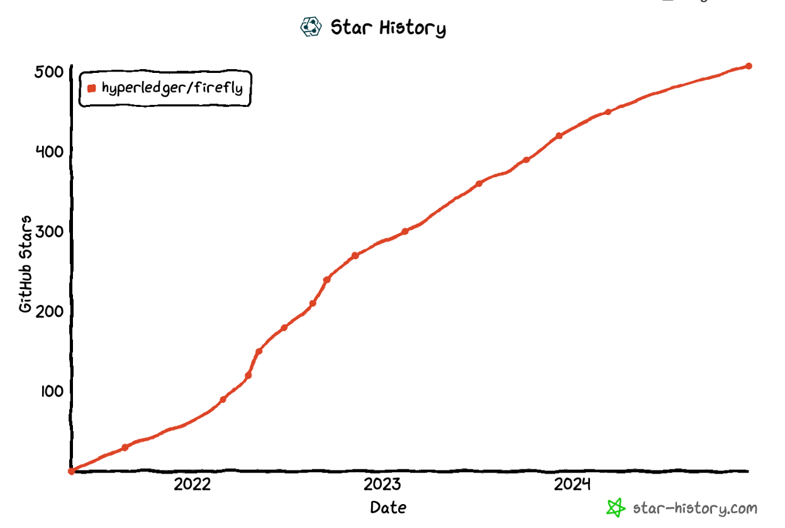
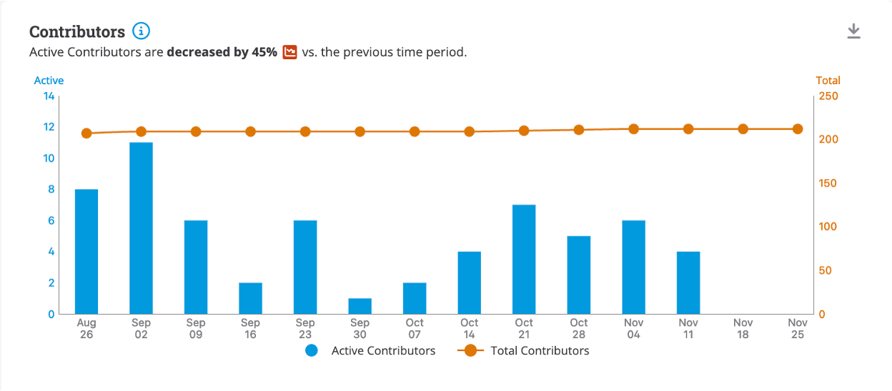
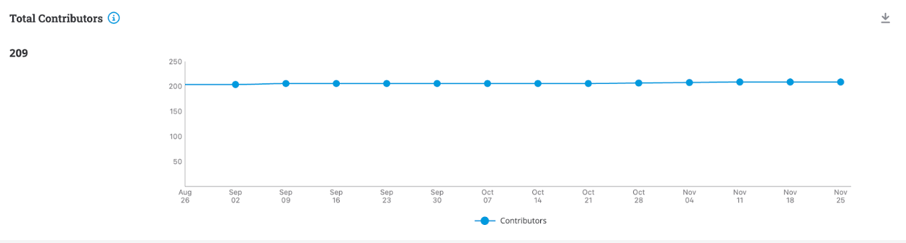
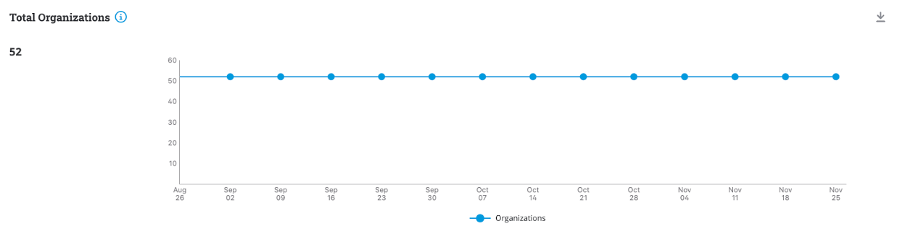
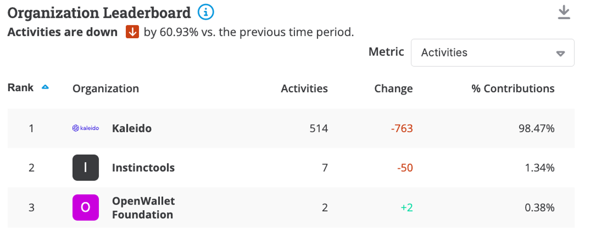
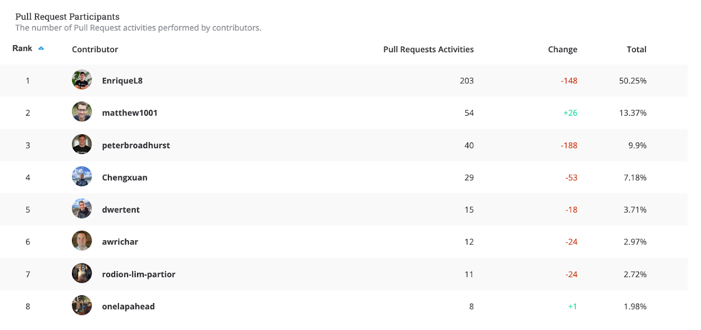

# Project Health

FireFly continues to be actively developed with the release of v1.3.2 this quarter. The release of 1.3.2 includes the following new features and enhancements.

__Bug Fixes:__

- Fixed doc site release action.
- Resolved protocol ID documentation issues.
- Fixed cache mismatch by deep copying operations.
- Addressed NPEs during background manager creation.

__Enhancements:__

- Added support for large JSON numbers in input parameters.
- Improved handling of "latest" image tagging during releases.
- Refactored event persistence to return a boolean status.
- Upgraded to Go 1.22.
- Updated FireFly CLI installation instructions.

__Documentation:__

- Updated protocol and custom smart contract documentation.
- Documented support for large JSON numbers in v1.3.2.
- Improved documentation for installation and release manifests.

### Community adoption updates

This quarter, community members have given talks featuring Hyperledger FireFly and attended events including:

- Linux Foundation Decentralized Trust Maintainer Days
- Linux Foundation Decentralized Trust Members Summit
- [Hyperledger FireFly explainer with Enrique Lacal](https://www.youtube.com/watch?v=AhILVoxg3x8)

### Contributor activity updates

The star activity for the FireFly repository has continued to grow from 496 end of last quarter to 508 end of this quarter. Discord activity has been very high this quarter with ~50 DAU.

Contributors are active in the project and since September, there were 22 contributors who performed at least one commit.
There are currently over 775k lines of code for Hyperledger FireFly across 20 repositories, with a total of 10.986k commits to date.

# Questions/Issues for the TOC

None

# Releases

This quarter, FireFly v1.3.2 was released. A high level overview of what’s new is below:

## [FireFly v1.3.2 (10/03/2024)](https://github.com/hyperledger/firefly/releases/tag/v1.3.2)

FireFly v1.3.2 new features include:

__Bug Fixes:__

- Fixed doc site release action.
- Resolved protocol ID documentation issues.
- Fixed cache mismatch by deep copying operations.
- Addressed NPEs during background manager creation.

__Enhancements:__

- Added support for large JSON numbers in input parameters.
- Improved handling of "latest" image tagging during releases.
- Refactored event persistence to return a boolean status.
- Upgraded to Go 1.22.
- Updated FireFly CLI installation instructions.

__Documentation:__

- Updated protocol and custom smart contract documentation.
- Documented support for large JSON numbers in v1.3.2.
- Improved documentation for installation and release manifests.

__Maintenance:__

- Updated dependencies: ffcommon, ffsigner, ffevmconnect, and firefly-tezosconnect.
- Pulled latest versions of UI, token connectors, and Tezos connect.
- Ignored markdown files and workflows in Docker and Go builds.
- Increased test coverage for missing scenarios.

For a full list of changes and updates, please visit [the FireFly Github](https://github.com/hyperledger/firefly/releases/tag/v1.3.2).

# Overall Activity in the Past Quarter

The major highlights have been detailed at the beginning of the report. In summary, there has been a lot of activity in the project. New community members continue to discover the project and make contributions. This quarter we have continued to see contribution and activities from outside the set of the original maintainers. A new Cardano Connector has been developed by an external party who did a great demo during the last community call. They are looking at contributing the connector into the LFDT.

# Current Plans

As part of our annual report, we listed the following goals for 2024.

- Release FireFly v1.3 (Q1) - This has been completed in Q2 2024.
- Host another in-depth workshop to get even more developers hands on with FireFly - An in-depth workshop is being planned and scheduled for 2025.
- Continue to increase diversity of maintainers - No new maintainers this quarter however FireFly has added three 3 new maintainers across 2 organizations since the beginning of the year.

# Maintainer Diversity

FireFly now has 14 maintainers representing three different companies:

- [Kaleido](https://kaleido.io/)
- [Fidelity](https://www.fidelity.com/)
- [OneOf](https://www.oneof.com/)

It is worth noting that each company has at least one maintainer who is a subject matter expert on one or more specific blockchain connectors, and the most foundational parts of the FireFly technology stack.

A list of all maintainers for Hyperledger FireFly may be found [here](https://wiki.hyperledger.org/display/FIR/Maintainers).

# Contributor Diversity

This past quarter we have seen a decrease in activity as the code base has continued to mature.

[Commit Activities](https://insights.lfx.linuxfoundation.org/foundation/lf-decentralized-trust/overview/github?project=firefly&repository=&routedFrom=Github)

# Additional Information

No additional information
