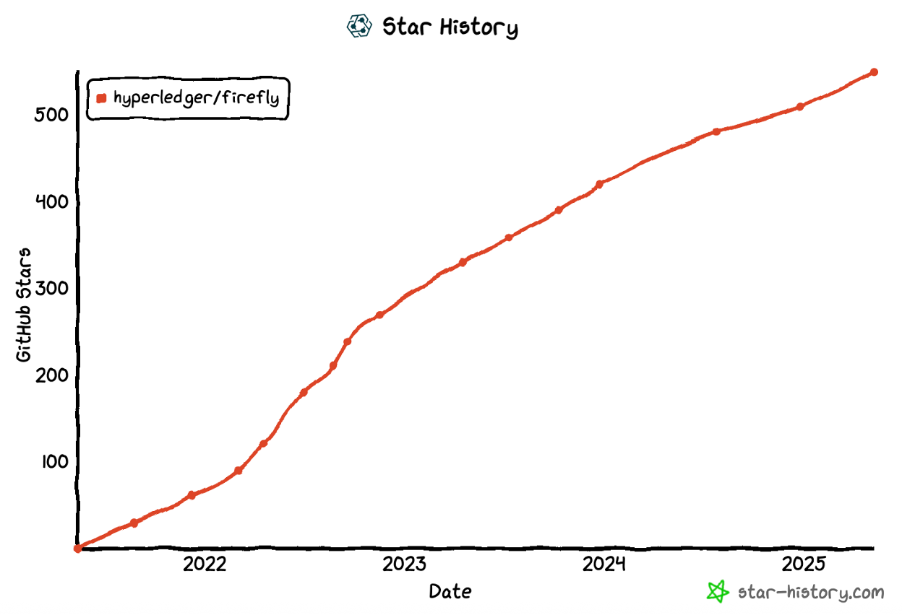
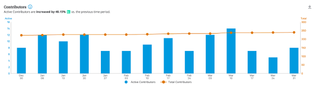
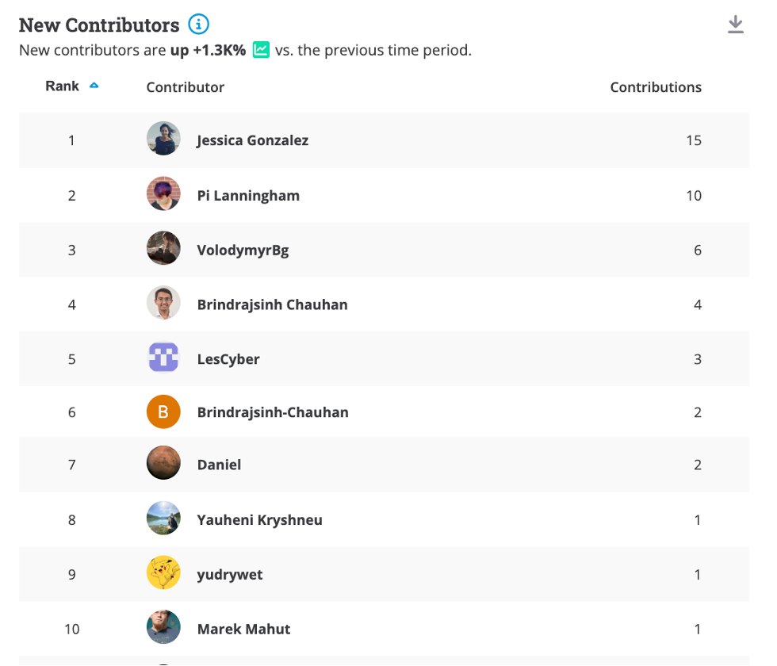
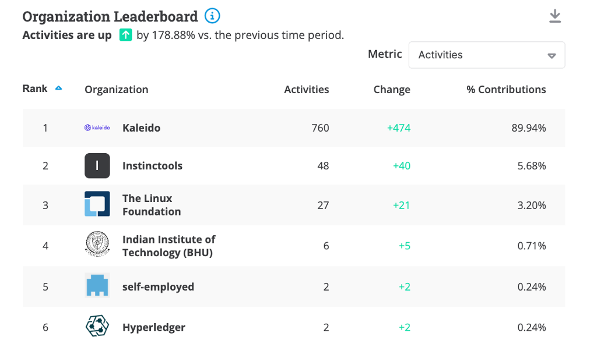
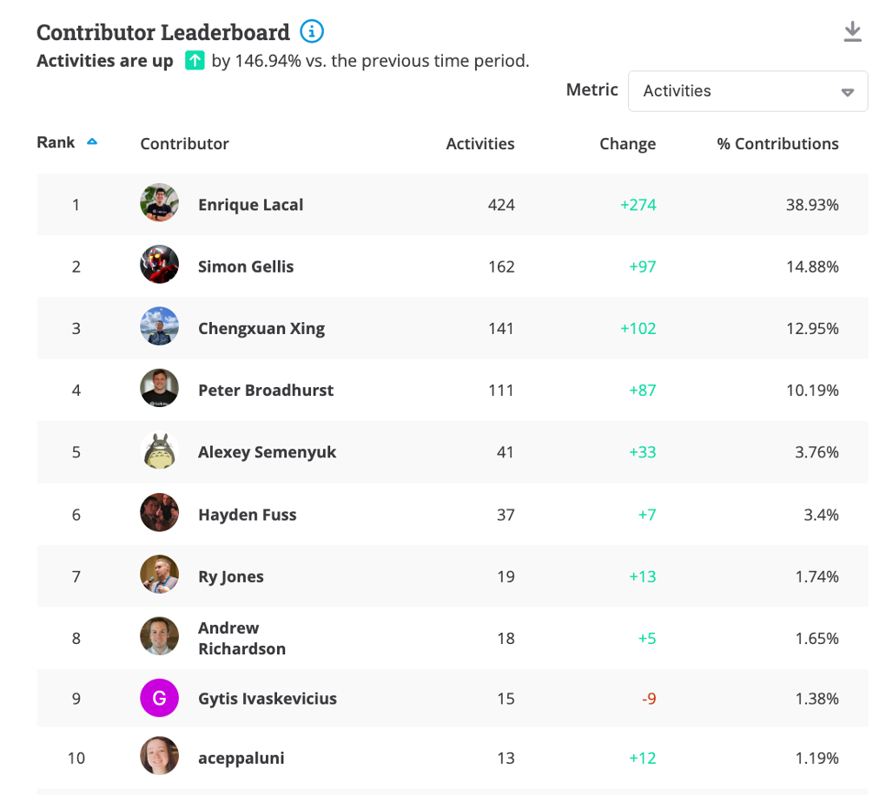

[//]: # (SPDX-License-Identifier: CC-BY-4.0)

# 2025 Q2 Hyperledger FireFly

## Project Health

One major milestone this quarter was the merging of the Cardano connector. This has been a multi-month effort with significant contributions from the Cardano team. Their work has been instrumental in the integration, and they are expected to be nominated for maintainer roles soon.

FireFly continues to be actively developed with the release of v1.3.3 this quarter. The release of 1.3.3 includes stability, security, and documentation improvements across the platform.

### Contributor activity updates

The star activity for the FireFly repository has continued to grow from 508 end of last quarter to 550 end of this quarter. Discord activity has been very high this quarter with ~55 DAU.

Contributors are active in the project and in Q1 2025, there were 40 contributors who performed at least one commit.

## Questions/Issues for the TOC

None

## Releases

This quarter, FireFly v1.3.3 was released. A high level overview of what’s new is below:

### [FireFly v1.3.3 (03/25/2025)](https://github.com/hyperledger/firefly/releases/tag/v1.3.3)

FireFly v1.3.3 new features include:

- __Reliability Enhancements:__ Improved operation handling to avoid infinite retries and ensure reliable receipts. Updated logic for duplicate batch handling and added deadlock fixes for data exchange reconnection.

- __Security Updates:__ Addressed multiple CVEs, including those in NPM packages. Integrated CodeQL and enhanced GitHub workflows with fine-grained permissions and PAT usage.

- __Documentation Improvements:__ Fixed Swagger links, added a troubleshooting section, updated the smart contracts async flow diagram, and clarified contract listener docs. Introduced a language switcher in the README.

- __Developer Tooling:__ Added issue and pull request templates, a .gitignore for Fabric binaries, and a CodeQL workflow. Updated dependency versions and linter fixes.

- __Monitoring & Metrics:__ Renamed metrics routes for extensibility, disabled new monitoring configs by default, and added DXConnect callbacks for node identity checks.

- __Infrastructure Updates:__ Upgraded Postgres and FireFly Common version, switched to Trivy ECR DB, and fixed Dockerfile git and alpine versions.

- __SDK Enhancements:__ The FireFly Node SDK was updated to align with the latest platform version, and improvements were made to the Swagger documentation for better developer experience.

For a full list of changes and updates, please visit [the FireFly Github](https://github.com/hyperledger/firefly/releases/tag/v1.3.3).

## Overall Activity in the Past Quarter

The major highlights have been detailed at the beginning of the report. In summary, there has been a lot of activity in the project. New community members continue to discover the project and make contributions. This quarter we have continued to see contribution and activities from outside the set of the original maintainers.

## Current Plans

As part of our annual report, we listed the following goals for 2025.

- Release FireFly v1.3.X - 1.3.3 has been released this quarter
- Continue to encourage and work with web3 protocols to successfully build connectors to FireFly
- Continue progress on FIR-18
- Fully onboard the Cardano Connector → Cardano connector is now merged; next steps include completing onboarding of contributors as maintainers.
- Increase diversity of maintainers by onboarding new contributors and formalizing maintainer roles -> No new maintainers this quarter
- [OpenSSF Scorecard](https://scorecard.dev/viewer/?uri=github.com/hyperledger/firefly): We have increased our score to 7.9 from 7.7 in February.
- Work on moving FireFly to its own organization in GitHub.

## Maintainer Diversity

FireFly now has 14 maintainers representing three different companies:

- [Kaleido](https://kaleido.io/)
- [Anchor Labs](https://www.anchorage.com/)
- [OneOf](https://www.oneof.com/)

It is worth noting that each company has at least one maintainer who is a subject matter expert on one or more specific blockchain connectors, and the most foundational parts of the FireFly technology stack.

A list of all maintainers for Hyperledger FireFly may be found [here](https://wiki.hyperledger.org/display/FIR/Maintainers).

## Contributor Diversity

This past quarter we have seen a decrease in activity as the code base has continued to mature.

[Commit Activities](https://insights.lfx.linuxfoundation.org/foundation/lf-decentralized-trust/overview/github?project=firefly&repository=&routedFrom=Github)

# Additional Information

No additional information
