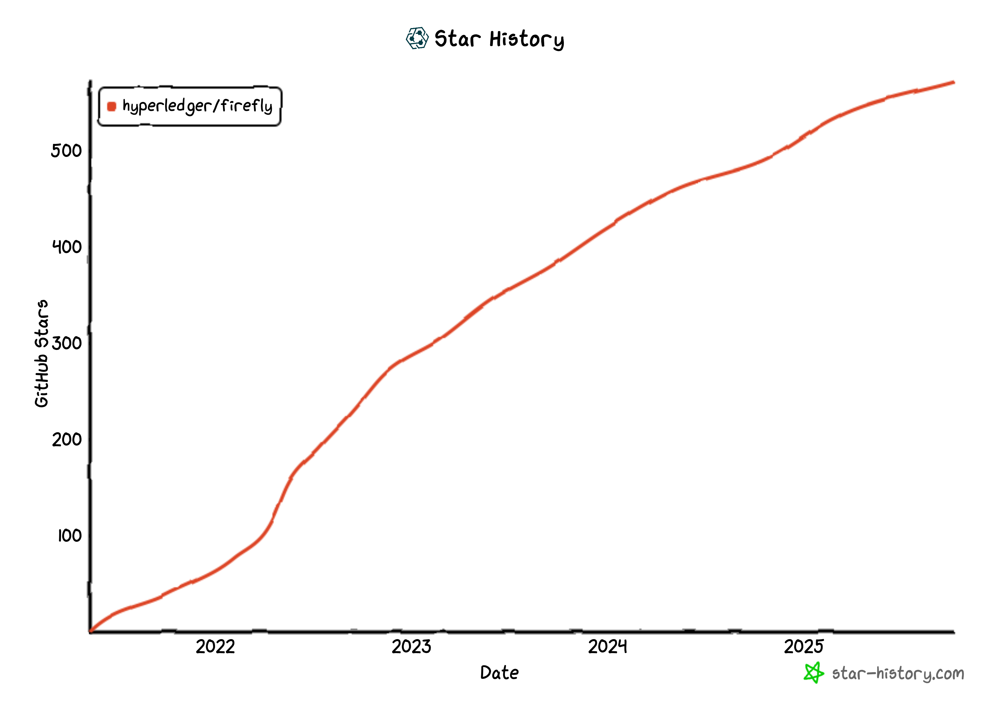
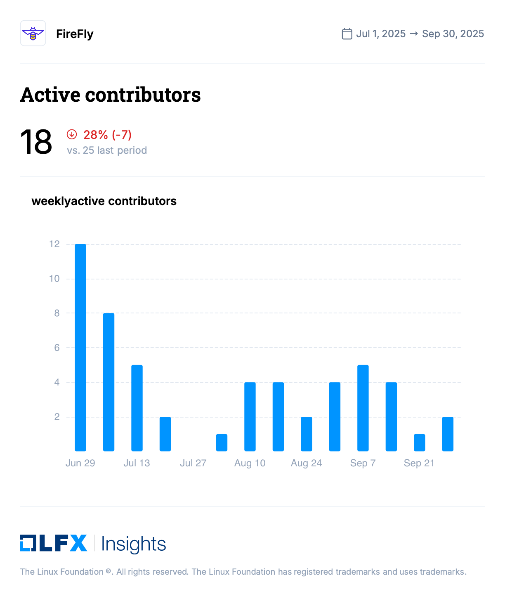
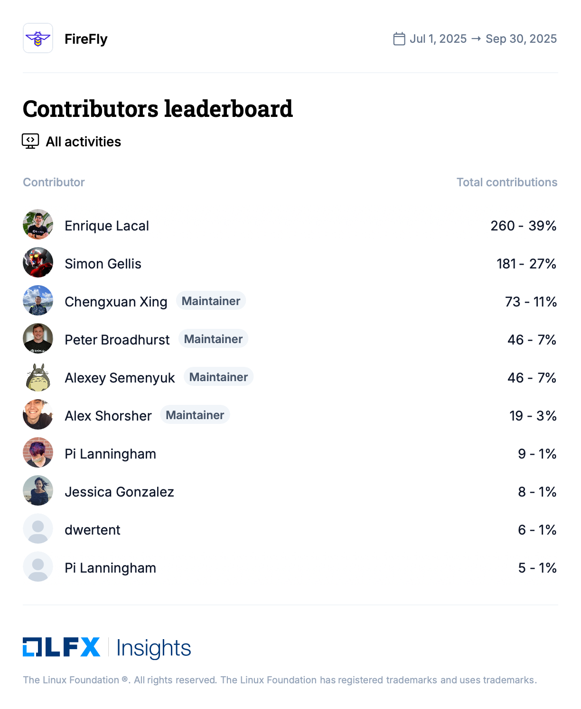
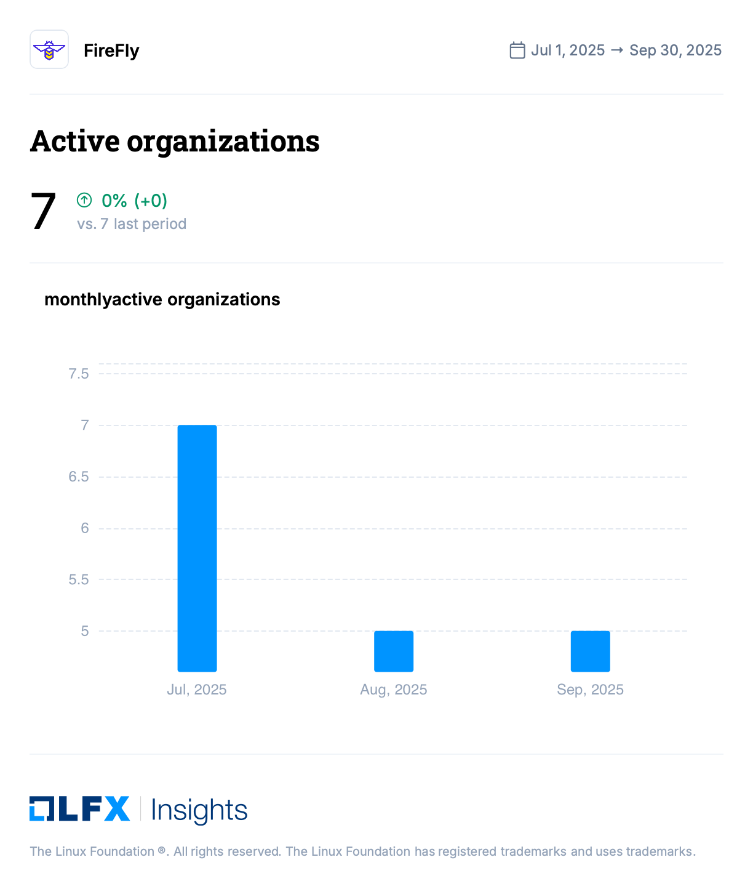

[//]: # (SPDX-License-Identifier: CC-BY-4.0)

# Project Health

The major milestone achieved this quarter was the release of Hyperledger FireFly v1.4.0. This new version marks a significant step forward, officially integrating the Cardano connector as a core blockchain plugin. This completes the multi-month effort mentioned in our last report thanks to the continued contributions from the Cardano team.

Additionally, we welcome Simon Gellis from Sundae Labs as a new maintainer.

The release of v1.4.0 introduces several key updates and improvements across the platform:

* **Official Cardano Connector**: The newly added and tested Cardano connector is now fully integrated, allowing developers to build applications on the Cardano network using FireFly. Documentation, including a new section in the README, has been added to support its use.

* **Core Technology Upgrades**: The platform's foundation has been strengthened by updating to **Go 1.23** and upgrading the **FireFly Common library to v1.5.6**. These changes improve performance, security, and compatibility.

* **Fixes and Reliability**: This release corrects an important issue with historical filtering for subscriptions, ensuring more accurate event processing. It also includes a fix for handling the `JSONAny` schema type in OpenAPI specifications.

* **Security and Dependency Management**: Key dependencies, such as `axios`, have been updated to their latest versions. Additionally, various packages within the base Docker image were bumped to maintain a secure and stable environment.

* **Documentation and Developer Experience**: The release notes formatting has been corrected for better readability. 

### Contributor activity updates

The star activity for the FireFly repository has continued to grow from 550 end of last quarter to 564 end of this quarter. Discord activity has been very high this quarter with \~60 DAU. 

Contributors are active in the project and in Q2 2025, there were 35 contributors who performed at least one commit.

# Questions/Issues for the TAC

None

# Releases

This quarter, FireFly v1.4 was released. A high level overview of what’s new is below:

## [FireFly v1.4.0](https://github.com/hyperledger/firefly/releases/tag/v1.4.0) (07/17/2025)

FireFly v1.4.0 new features include:

### **Major Feature: Cardano Connector Integration**

* **Official Cardano Support**: The Cardano connector is now an officially supported plugin within Hyperledger FireFly. This allows organizations to build and manage web3 applications on the Cardano blockchain.  
* **Updated Integration**: The release includes the newest `firefly-cardano` Docker image and final integration updates, completing the development cycle for this feature.  
* **New Documentation**: To support developers, the main `README.md` file has been updated with information on how to configure and use the Cardano connector.

### **Core Platform Enhancements**

* **Go Version Upgrade**: The core codebase has been updated to **Go 1.23**. This brings performance improvements, access to new language features, and updated security standards to the FireFly runtime.  
* **Connector Toolkit Updates**: Enhancements to the connector framework to expose internal event listeners to consume directly instead of using external listeners.  
* **FireFly Common Library Update**: The platform was upgraded to use **FireFly Common v1.5.6**, incorporating the latest shared logic, fixes, and improvements from the common library.  
* **Updated Dependencies**: Several key dependencies were updated to their latest versions, including a bump for `axios` in the smart contracts package and other package version updates in the base Docker image to maintain security and stability.

### **Fixes and Reliability**

* **Subscription Filtering Fix**: A bug affecting historical filtering for subscriptions has been corrected. This ensures that when a new subscription is created, it correctly processes all relevant historical events from the blockchain.  
* **OpenAPI Schema Fix**: An issue with the OpenAPI `JSONAny` schema type, inherited from FireFly Common, has been fixed. This improves API data handling and compatibility with API generation tools.

### **Developer Experience**

* **Code Quality Improvements**: Internal code has been refactored to use modern standard library functions like `slices.Contains`, making the FireFly codebase cleaner, more efficient, and easier for contributors to maintain.  
* **Improved Documentation Formatting**: A minor fix was made to correct list formatting in the release notes, improving their readability.

For a full list of changes and updates, please visit https://github.com/hyperledger/firefly/releases.

# Overall Activity in the Past Quarter

The major highlights have been detailed at the beginning of the report. In summary, there has been a lot of activity in the project. New community members continue to discover the project and make contributions. This quarter we have continued to see contribution and activities from outside the set of the original maintainers. 

# Current Plans

* **Release FireFly v1.3.X** \- 1.4 has been released this quarter  
* **Continue to encourage and work with web3 protocols to successfully build connectors to FireFly** We took part of a Hackathon called JulyOfCode organised by the Cardano community. Spoke on Twitter/X spaces and got engaged with that community.  https://julyofcode.dev
* **Continue progress on FIR-18**  
* **Fully onboard the Cardano Connector →** *Cardano connector is fully merged*  
* **Increase diversity of maintainers by onboarding new contributors and formalizing maintainer roles** \-\> One new maintainer is onboarded from Sundae Labs  
* [**OpenSSF Scorecard**](https://scorecard.dev/viewer/?uri=github.com/hyperledger/firefly)**:** Our score is 7.5, down from 7.9 last quarter and 7.7 in February. This will be addressed in the coming quarter.  
* **Work on moving FireFly to its own organization in GitHub.** 

# Maintainer Diversity

FireFly has 15 maintainers representing four different companies:

* [Kaleido](https://kaleido.io/)  
* [Anchor Labs](https://www.anchorage.com/)  
* [OneOf](https://www.oneof.com/)  
* [Sundae Labs](https://sundae.fi/)

It is worth noting that each company has at least one maintainer who is a subject matter expert on one or more specific blockchain connectors, and the most foundational parts of the FireFly technology stack.

A list of all maintainers for Hyperledger FireFly may be found [here](https://wiki.hyperledger.org/display/FIR/Maintainers). 

### Contributor Diversity  

This past quarter we have seen a decrease in activity as the code base has continued to mature.

https://insights.lfx.linuxfoundation.org/foundation/lf-decentralized-trust/overview/github?project=firefly\&repository=\&routedFrom=Github

