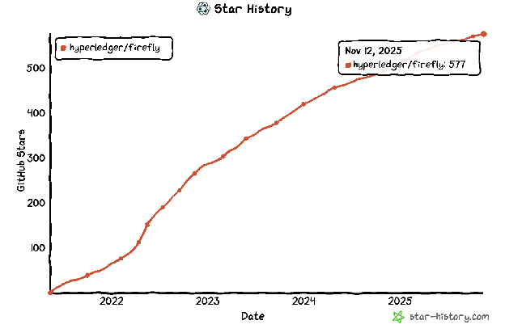

[//]: # (SPDX-License-Identifier: CC-BY-4.0)

# Project Health

This quarter, focus was on enhancements and hardening of the core transaction management and connectivity layers of FireFly. While there were no new formal version releases, significant development work was completed on the EVM Connector and FireFly Transaction Manager to improve transaction reliability and observability.

Enhancements in the Connector Toolkit and implementation of the EVM Connector include:

* **Transaction lifecycle management:** A new PATCH `/transactions/{transactionId}` API endpoint was introduced. This update improves the transaction handler interface to allow users to modify parameters of existing transactions, such as gas price, providing a mechanism to manually resolve stuck transactions.  

* **Performance and reconciliation:** To improve efficiency, a new `ReconcileConfirmationsForTransaction` method has been added. This leverages the in-memory canonical chain to efficiently calculate transaction confirmations for external confirmation checking.

**Contributor activity updates:**

The star activity for the FireFly repository has continued to grow from 564 end of last quarter to 577 end of this quarter. Discord activity has been very high this quarter with \~60 DAU.

Contributors are active in the project and in Q3 2025, there were 18 contributors who performed at least one commit.

# Questions/Issues for the TOC

None

# Releases

We have had regular releases through out the year and are aiming for a patch release in the next quarter.

For a full list of changes and updates, please visit <https://github.com/hyperledger/firefly/releases>.

# Overall Activity in the Past Quarter

The major highlights have been detailed at the beginning of the report. In summary, there has been a lot of activity in the project across the repos but it hasn't surfaced into a release. New community members continue to discover the project and make contributions. This quarter we have continued to see contribution and activities from outside the set of the original maintainers.

# Current Plans

It's always helpful to review in a Q4 report what the goals were at the beginning of the year and if we have made progress towards them.

* **Release FireFly v1.3.X** \- 1.4.0 has been released this quarter  
* **Continue to encourage and work with web3 protocols to successfully build connectors to FireFly** \-\> Maintainers have attended multiple web3 events across the year
* **Continue progress on FIR-18** some progress at the beginning of the year, but not closed out  
* **Fully onboard the Cardano Connector →** *Cardano connector is fully merged*  
* **Increase diversity of maintainers by onboarding new contributors and formalizing maintainer roles** \-\> One new maintainer is onboarded from Sundae Labs  
* [**OpenSSF Scorecard**](https://scorecard.dev/viewer/?uri=github.com/hyperledger/firefly)**:** Our score is 6.9, down from 7.9 last quarter and 7.7 in February. This will be addressed in the coming weeks before end of year.  
* **Work on moving FireFly to its own organization in GitHub.**

# Maintainer Diversity

FireFly has 15 maintainers representing four different companies:

* [Kaleido](https://kaleido.io/)  
* [Anchor Labs](https://www.anchorage.com/)  
* [OneOf](https://www.oneof.com/)  
* [Sundae Labs](https://sundae.fi/)

It is worth noting that each company has at least one maintainer who is a subject matter expert on one or more specific blockchain connectors, and the most foundational parts of the FireFly technology stack.

A list of all maintainers for Hyperledger FireFly may be found [here](https://wiki.hyperledger.org/display/FIR/Maintainers).

Contributor Diversity  

This past quarter we have seen a decrease in activity as the code base has continued to mature.

<https://insights.linuxfoundation.org/project/firefly/contributors?timeRange=past90days\&start=2025-08-14\&end=2025-11-12>

![][./images/FF-Q4-Active-Contributors.png]
![][./images/FF-Q4-Active-Organizations.png]
