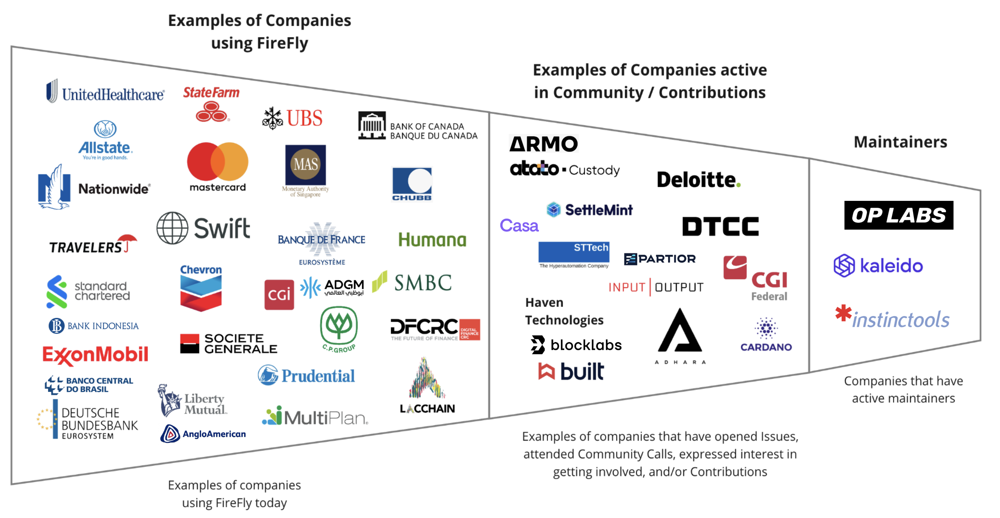

[//]: # (SPDX-License-Identifier: CC-BY-4.0)

# 2025 Annual Review Hyperledger FireFly

### Project Health

Hyperledger FireFly released version 1.3.2, an upgrade over V1.2 where FireFly was at the beginning of the year. We have seen continued contributions in the community including major additions such as the Cardano connector (Sundaelabs). Additionally, the maintainer base for [Paladin](https://www.lfdecentralizedtrust.org/blog/announcing-paladin-an-lf-decentralized-trust-lab-for-programmable-privacy-on-evm), a Linux Foundation Decentralized Trust Lab, has a significant maintainer overlap, with 4,000 commits of FireFly-related code contributed in the last six months. The community is exploring the potential of Paladin being a FireFly connector.

In 2024, contributors decreased by 15% YOY. However, FireFly is in a more mature and stable state than when V1.0 and V1.2 were released in 2022 and 2023 respectively. FireFly has seen continued adoption from dozens of large enterprises across a variety of industries and increased contributions through the connector work highlighted above.

LFX Insights report for 2024 [here](https://insights.lfx.linuxfoundation.org/foundation/lf-decentralized-trust/overview/github?project=firefly&repository=all&routedFrom=Github&dateFilters=2024-01-01%20to%202024-12-31&dateRange=2024-01-01%20to%202024-12-31&compare=PP&granularity=month&hideBots=true)

### Highlights from the 2024 Insights report

* 73 contributors
* 1439 commits
* 57% of code activities were performed by 3 people (from Kaleido)
* 87% of code activities were performed by 1 organization (Kaleido)
* There were a total of 17 organizations and 74 contributors
* The top five regions activity include:
  * United States (41%)
  * UK (27%)
  * Poland (9%)
  * Bulgaria (5%)
  * Brazil (5%)

### Maintainer Diversity

FireFly now has 14 maintainers representing three different companies:

* [Kaleido](https://kaleido.io/)
* [OP Labs](https://www.oplabs.co/)
* [InstinctTools](https://www.instinctools.com/)

It is worth noting that each company has at least one maintainer who is a subject matter expert on one or more specific blockchain connectors, and the most foundational parts of the FireFly technology stack:

* Kaleido: core architecture
* OP Labs: connectivity and transaction model with the Ethereum protocol
* InstinctTools: connectivity and transaction model with the Tezos protocol

A list of all maintainers for Hyperledger FireFly may be found [here](https://wiki.hyperledger.org/display/FIR/Maintainers).

### Project Adoption

What do you know about adoption, and how has this changed since your last review or since being accepted into Hyperledger Foundation? If you can list companies that are adopters of your project, please do so. Feel free to link to an existing ADOPTERS file if appropriate.

Hyperledger FireFly continues to be adopted by world leading companies throughout the world. Fidelity, Deloitte, DTCC, Atato, CGI Federal, and more are just some of the names who have taken either a maintainer role or are actively contributing to the community. Examples of top enterprises using FireFly include SWIFT, Allstate, ExxonMobil, Nationwide, Humana, Mastercard, and more.

## Goals

### Performance Against Prior Goals

**2024 goals:**

* Release FireFly v1.3 (Q1) Completed, with subsequent patches (v1.3.1, v1.3.2)
* Host another in-depth workshop to get even more developers hands-on with FireFly Not completed, will be scheduled in QX 2025.
* Planning around FireFly 2.0 Delayed
* Continue to increase diversity of maintainers Ongoing. Have a proposal in place to onboard a new organization as a maintainer.

**Noteworthy accomplishments in 2024**

* Release of FireFly V1.3.0, V1.3.1, & V1.3.2
* V1.3.0 introduced namespace isolation, custom smart contracts with data association, PostgreSQL support, optimized Hyperledger Besu integration, and a Tezos connector. V1.3.0 had significant amount of new features highlighted in this webinar <https://www.youtube.com/watch?v=zR_JwW1V9Og>
* [V1.3.1](https://github.com/hyperledger/firefly/releases/tag/v1.3.1) enhanced listener functionality, documentation, multiparty status API, Ethereum signing keys, namespace management, websockets, and performance.
* [V1.3.2](https://github.com/hyperledger/firefly/releases/tag/v1.3.2) included bug fixes, support for large JSON numbers, upgraded dependencies, and improved documentation and testing.
* Progress on the Cardano connector with new contributors from Blockfrost.io
* A demo of the new Cardano connector was demoed during the November 13th, 2024 community call (<https://www.youtube.com/watch?v=8R_DGS-OwgE>)
* Cardano connector for FireFly focuses on integrating Cardano with key features that includes the ability to build, sign, and submit transactions, as well as respond to chain events.
* Increased enterprise adoption and stability improvements
* Tezos connector enhancements, including ability to deploy contracts via FireFly, to invoke queries that execute methods on blockchain smart contracts without affecting the blockchain state, etc
* Tezos connector migration from Blockwatch to the TriliTech TzGo SDK, including an update to support the Paris protocol
* Webinars on Tezos connector for Tezos <https://www.youtube.com/watch?v=5JltpG90I8o> and for Hyperledger youtube.com/watch?v=5Y2Wnld0aJg communities

### Next Year's goals

* Release FireFly v1.3.X (further enhancements and stability improvements)
* Host a developer workshop to engage the community
* Continue progress on [FIR-18] (<https://github.com/hyperledger/firefly-fir/pull/18>)
* Fully onboard the Cardano Connector
* Increase diversity of maintainers by onboarding new contributors and formalizing maintainer roles
* OpenSSF Scorecard: work has already begun to align with the requirements of the scorecard but will be finalized in 2025
* Currently we are at an **8.1** and will work to address the identified items in the scorecard to further increase the score.
* Work on moving FireFly to its own organization in GitHub. This is a significant piece of work given the amount of packages and repositories whilst making sure not to break consumers.
* Add an ADOPTERS.md file to the main FireFly repository

### Help Required

* Work with the TAC and Hyperledger staff to identify and recruit potential maintainers from outside Kaleido.
* Engage existing maintainers and assess ongoing commitment levels.
* Expand engagement with enterprises using FireFly to encourage more external contributions.
  * Focus on core maintainers for varied organizations
  * Onboard connector maintainers

## Project Lifecycle Stage Recommendation

We believe that Hyperledger FireFly should maintain its **graduated status**, given its stable enterprise adoption and ongoing evolution. The project continues to be widely used in real-world implementations and remains a key component of enterprise blockchain solutions.
